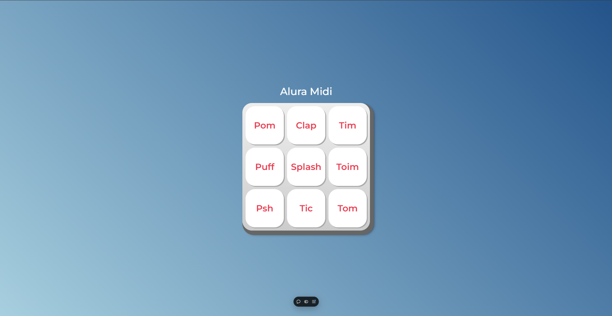

# Treinamento em JavaScript e Manipulação do DOM

Este repositório contém um projeto focado no **treinamento de JavaScript** e na **manipulação do DOM (Document Object Model)**. O objetivo principal foi praticar conceitos fundamentais de JavaScript enquanto explorava a interação dinâmica com elementos HTML.

---

## Tecnologias Utilizadas

- **HTML5**
- **CSS3**
- **JavaScript (ES6+)**

---

## Objetivo do Projeto

- Praticar a manipulação do DOM para alterar elementos, estilos e comportamentos dinamicamente.
- Aprender e aplicar eventos do JavaScript, como cliques, teclas e interações do usuário.
- Desenvolver uma aplicação simples e interativa como parte do aprendizado.

---

## Pré-visualização

  

---

📚 *Projeto desenvolvido para praticar JavaScript e manipulação do DOM.*
